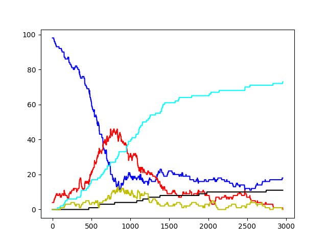

# Sickness Simulator

This application was made to simulate how sickness spreads by proximity. 

## Agent Types
Here are all of the different agent types.

### Healthy
Completely normal person with no immunity. These are the blue ones.

### Infected
A person who carries the disease. These are the red ones.

### Immune
Has developed immunity after being infected. These are the cyan ones.

### Temporarily Immune
Is temporarily immune to prevent being infected just after healing. These are the yellow ones.

### Dead
Has died. These are the black ones.

## Parameters
Here is a list of all the parameters and a description of them.

### -width
Decides the width of the canvas. Default value is 500.

### -height
Decides the height of the canvas. Default value is 500.

### -pop
Decides how many agents should be made. Default is 100.

### -chanceDeath
Decides how likely it is for an infected person to die. Default value is 0.01.

### -chanceImmune
Decides how likely it is for an infected person to become immune. Default value is 0.05.

### -chanceHealthy
Decides how likely it is for an infected person to become healthy. Default value is 0.1.

### -speed
Decides how far an agent moves each frame. Default value is 30.

### -squareLength
Decides how big the agent is. Default value is 5.

### -spreadRadius
Decides how far an infected agent can infect. Default value is 20

### -tempImmuneMin
Decides
